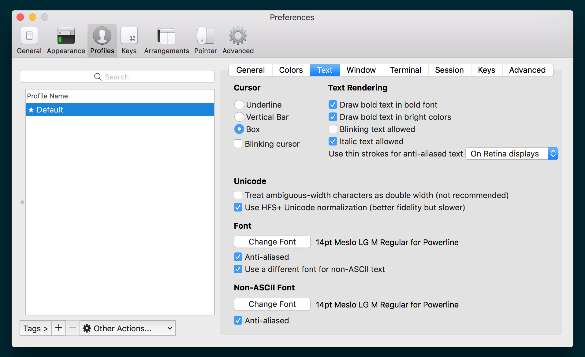

## DotFiles

### Powerline Fonts

[Download](https://github.com/powerline/fonts)

### Install

    # Install Macvim
    brew install macvim --custom-icons --override-system-vim --with-lua --with-luajit --with-cscope

    git clone git@github.com:ChuckJHardy/DotFiles.git ~/.dotfiles
    ln -s ~/.dotfiles/chuckjhardy.zsh-theme ~/.oh-my-zsh/themes/chuckjhardy.zsh-theme
    cd ~/.dotfiles
    brew bundle
    rake
